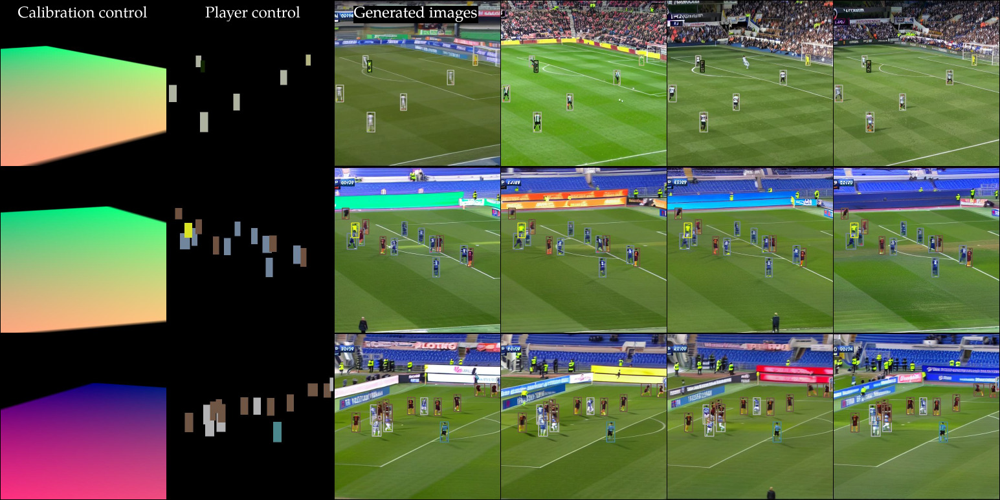

<div align="center">

<h2><center>[CVPRW 2025] Towards fine-grained spatial control for soccer game image generation</h2>

Amadou S. Sangare, Adrien Maglo, Baptiste Engel, Mohamed Chaouch
<br>
Université Paris-Saclay, CEA, List, F-91120, Palaiseau, France
<br>
</div>

---



## Abstract
Image generation with spatial conditioning has been an active research topic. Its application to soccer images enables the creation of synthetic data for training, content generation, entertainment, and advertising. By incorporating additional control modalities beyond text, spatially conditioned image generation models allow fine-grained control over the positions of elements of interest in the generated images. However, when applied to soccer images, these models struggle to precisely control player jersey colors and fail to accurately position the soccer pitch withinthe image. In this work, we propose a framework called **SoccerGen** that addresses these limitations. It enables precise control over camera calibration, the positions of the ball and the players, and the colors of player jerseys. To the best of our knowledge, this work is the first to tackle the challenges of finely controlled soccer image generation.

## Installation
This installation section is intented for users of the Anaconda environment. The reader needs to adapt the instructions for other Python environment management tools.

```bash
# Clone this repository
git clone https://github.com/CEA-LIST/SoccerGen
cd SoccerGen

# Create environment and install dependencies
conda create -n soccergen python=3.12.3
conda activate soccergen
conda install pytorch==2.2.2 torchvision==0.17.2 pytorch-cuda=12.1 -c pytorch -c nvidia
pip install --no-deps -r requirement.txt
```

## Setting up the dataset
To train SoccerGen yourself, prepare the two following dataset and place them in the [datasets]('./datasets) folder:

The `Soccer` dataset is used to fine-tune Stable diffusion. It needs to have the following structure:
```
Soccer
|── train
|   |── 1.jpg
|   |── 2.jpg
|   |── ...
|   └── m.jpg
|── val
|   |── 1.jpg
|   |── 2.jpg
|   |── ...
|   └── m.jpg
```

The `SoccerConditional` dataset is used to train SoccerGen for controllable image generation. The structure should be:
```
SoccerConditional
|── train
|   |── images
|       |── 1.jpg
|       |── 2.jpg
|       |── ...
|       └── m.jpg
|   |── homographies
|       |── 1.npy
|       |── 2.npy
|       |── ...
|       └── m.npy
|   └── metadata.json
── val
|   |── images
|       |── 1.jpg
|       |── 2.jpg
|       |── ...
|       └── m.jpg
|   |── homographies
|       |── 1.npy
|       |── 2.npy
|       |── ...
|       └── m.npy
|   └── metadata.json
```
The .npy file contains the homography matrix from the soccer field template domain to the image domain. The metadata.json file should have the following structure:
```json
[
  {
    "image_path": "images/1.jpg",
    "homography_path": "homographies/1.npy",
    "detections": [
      {
        "cls": "player",
        "x1": 0.43205398321151733,
        "y1": 0.5331635475158691,
        "x2": 0.45424574613571167,
        "y2": 0.642113983631134,
        "color": [
          215, // r
          220, // g
          216 // b
        ],
        "team": 0
      },
      {
          "cls": "player",
          "x1": 0.10821255296468735, // x1, y1, x2, y2 normalized to [0, 1]
          "y1": 0.7493675351142883,
          "x2": 0.1544671654701233,
          "y2": 0.9014619588851929,
          "color": [
              215,
              220,
              216
          ],
          "team": 0
      },
      ...
    ]
  },
  ...
]
```

## Training
### Fine-tuning base Stable Diffusion 1.5 for soccer image generation
First fine-tuning Stable Diffusion for text-to-soccer image generation yields better control visual results. To do so, first download the [Stable Diffusion 1.5 checkpoint](https://huggingface.co/stable-diffusion-v1-5/stable-diffusion-v1-5/blob/main/v1-5-pruned.ckpt) and launch the following command
```bash
python train.py \
--config configs/latent-diffusion/soccer_sd15_ldm_kl_4.yaml \
--experiment_label <experiment-label> \
--experiment_version <experiment-version> \
--pretrained_init_path path/to/sd15/checkpoint \
--lr <learning-rate> \
--max_steps <training-steps>
--seed 1337
```
This command will launch a full fine-tuning of the given model. Checkpoints will be stored on a created `checkpoints` directory under the name format `<experiment-label>_<experiment-version>suffix` where **suffix** gives informations on the training step where the checkpoint has been created. For a completed training, there will be a checkpoint with the ***-last*** suffix.

### Preparing the Stable Diffusion checkpoint for controllable generation training
Before starting to train **SoccerGen** you need to prepare the initial weights. Run the following command:
```bash
python tool_add_control.py path/to/base/checkpoint models/soccergen_ini.ckpt
```
The first path should be that of the fine-tuned Stable Diffusion for soccer game image generation. At this step, `checkpoints/<experiment-label>_<experiment-version>-last.ckpt`. Note that `<experiment-label>` and `<experiment-version>` must be replaced by the values specified in the previous step. Moreover this two first steps are done once for all. You just need to re-use the same initial checkpoint for each **SoccerGen** training.

### Training SoccerGen

Now you are ready to train SoccerGen. Run, the following command:
```bash
python train_controlnet.py \
--config configs/controlnet/soccergen_sd15.yaml \
--experiment_label <experiment-label> \
--experiment_version <experiment-version> \
--pretrained_init_path models/soccergen_ini.ckpt \
--max_steps <training-steps>
--lr <learning-rate>
--seed 1337
```

One can either use our pre-trained checkpoint [checkpoints/soccergen_ini.ckpt](models/soccergen_ini.ckpt) or its own.

## Inference

### Inference with the fine-tuned Stable Diffusion
```bash
python stable_diffusion_inference.py \
--config configs/latent-diffusion/soccer_sd15_ldm_kl_4.yaml \
--ckpt_path path/to/checkpoint \
--batch_size <batch_size> \
--ddim_steps <sampling_steps> \
--cfg_scale <classifer_guidance_scale> \
--save_path path/to/saving/folder
```

The `batch_size` argument specifies the number of images to generate. To activate the classifier guidance, give a `cfg_scale` > 1.0<br/>
One can either use our pre-trained checkpoint [checkpoints/soccer_sd15.ckpt](checkpoints/soccer_sd15.ckpt) or its own.

### Inference with SoccerGen
```bash
# All conditions
python soccergen_inference.py \
--config configs/controlnet/soccergen_sd15.yaml \
--ckpt_path checkpoints/soccergen_sd15.ckpt \
--input_json demos/all_conditions.json \
--batch_size 2 \
--ddim_steps 50 \
--cfg_scale 8 \
--save_path inferences
```
```bash
# Calibration
python soccergen_inference.py \
--config configs/controlnet/soccergen_sd15.yaml \
--ckpt_path checkpoints/soccergen_sd15.ckpt \
--input_json demos/calibration.json \
--batch_size 2 \
--ddim_steps 50 \
--cfg_scale 8 \
--save_path inferences
```
```bash
# Positions and jerseys' colors
python soccergen_inference.py \
--config configs/controlnet/soccergen_sd15.yaml \
--ckpt_path checkpoints/soccergen_sd15.ckpt \
--input_json demos/positionxcolor.json \
--batch_size 2 \
--ddim_steps 50 \
--cfg_scale 8 \
--save_path inferences
```

One can either use our pre-trained checkpoint [checkpoints/soccergen_sd15.ckpt](checkpoints/soccergen_sd15.ckpt) or its own.

# Citation

    @misc{sangare2025soccergen,
      title={Towards fine-grained spatial control for soccer game image generation}, 
      author={Amadou S. Sangare, Adrien Maglo, Baptiste Engel, Mohamed Chaouch},
      booktile={CVPRW}
      year={2025}
    }